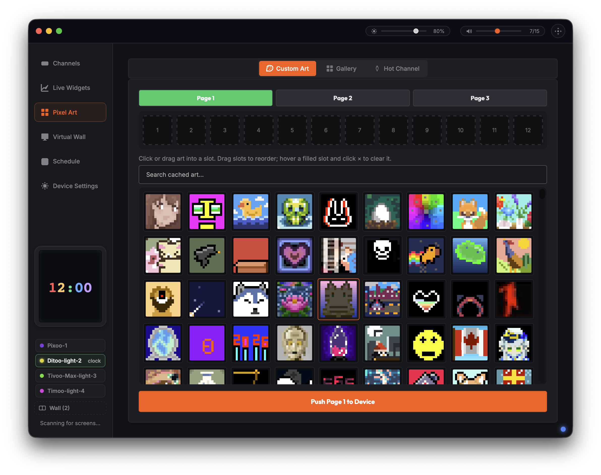

# divoom-control



Control Divoom pixel-display devices (Pixoo / Tivoo / Timebox / Ditoo …) as a
**Python library**, a **headless daemon** (local or over the network), and a
**desktop Control Center app**.

The project has three Python packages, two native **Rust** binaries (the daemon
and the menu-bar agent), and a native accelerator:

1. **`divoom_lib/`** — the shared protocol core: SPP framing, the command and
   capability models, the transport interface, cloud auth, the native-library
   loader, plus the CLI (`divoom-control`) and the MCP server, both of which are
   daemon clients. Runs on **macOS and Linux**. (The direct-to-device Python
   library — the `Divoom` facade and its BLE/LAN/SPP transports — is retired
   from the product and lives on as `examples/divoom_legacy/`, standalone.)
2. **`divoomd/`** — the native **Rust** daemon: a headless, always-on agent that
   is the **single owner** of the device connection and serves a command/event
   protocol over a Unix socket and (optionally) TCP. On macOS it also does
   notification monitoring. Runs on **macOS and Linux**. Paired with a **native
   Rust menu-bar agent**, `divoom-menubar/` — together these are what
   the shipped app runs. `divoom_client/` (the Python package) is client-only:
   the shared NDJSON-socket client library every consumer (GUI, menubar, CLI,
   MCP) uses to talk to whichever daemon is running. The original Python daemon
   *server* implementation was archived (2026-07-13) and then removed from the
   tree in R66 (2026-08-17) -- recover from git history (archived in 046cdf8, removed in R66 2026-08-17)
   once the Rust daemon reached parity — kept for historical reference only, not
   built, run, or tested by anything in this repo.
3. **`divoom_gui/`** — a [pywebview](https://pywebview.flowrl.com/) desktop
   **Control Center** (macOS): live previews, channel grid, live widgets (album
   art / stocks / system monitor), a gallery, a multi-panel "virtual wall", and a
   tools/settings area. It is a **thin client of the daemon** — it owns no BLE
   connection and auto-spawns the daemon if one isn't running.

The **native accelerator** `divoom_lib/libdivoom_compact.{dylib|so}` (palette
encoder, LANCZOS downsampler, frame escaping) is built from
`divoom_lib/native_src/`. Every accelerated path has a pure-Python fallback, and
both are held to the same correctness tests (see *Testing*).

> Unofficial project, not affiliated with Divoom. Use at your own risk.

---

## Features

- **Discovery** — scan for Divoom devices over BLE; manage known LAN devices.
- **Channels** — Clock, Cloud, VJ Effects, EQ/visualizer, Ambient light,
  Scoreboard, Text.
- **Image & animation push** — static images and GIFs, palette-encoded and
  streamed via the 0x8B 3-phase protocol (16px today; 32px encoder included).
- **Live widgets** — auto-push **album cover art** on track change (Spotify /
  Apple Music, macOS), **stock tickers**, and a **system monitor**.
- **Gallery** — browse + sync the Divoom "monthly best" gallery to the device.
- **Virtual wall** — drive a multi-panel grid as one composite display.
- **Tools** — alarms, sleep aid, timer / countdown / noise meter, FM radio,
  anniversary/memorial countdown.
- **Device settings** — brightness, 12/24h, °C/°F, orientation & mirror, name,
  auto-power-off, time sync, weather push, factory reset.
- **Notification mirroring** — trigger the device's notification display (macOS).
- **Headless / networked** — run the daemon on one machine (e.g. a Linux box near
  the device) and control it from another over TCP with a shared token.

---

## Requirements

- **macOS (Apple silicon) or Linux (x86_64 / aarch64)** for `divoom_lib` +
  `divoomd`. **Intel Macs are not supported** — Apple has dropped them, so have
  we; note this is macOS-specific, Linux x86_64 remains fully supported. 32-bit
  targets (i686 / armv7) are not supported on any OS. (BLE via `bleak` in Python /
  `btleplug` in Rust — CoreBluetooth on macOS, BlueZ on Linux). The **GUI +
  menu-bar + now-playing sync are macOS-only** today.
- **Python 3.14** (uses `X | None` type syntax). CI and the shipped app build on
  **Python 3.14**.
- Python deps in `requirements.txt` (`bleak`, `aiohttp`, `pillow`, `pywebview`, …).
- **Rust** (stable, via `rustup`) to build the daemon (`divoomd`) + menu-bar —
  `./build.sh`.
- A C compiler (clang/gcc) is optional — only to build the native accelerator;
  without it everything falls back to pure Python.

## Install

### macOS app (Homebrew)

The packaged Control Center app installs via the [`ztomer/tap`](https://github.com/ztomer/homebrew-tap)
Homebrew tap — no Python setup required:

```bash
brew install --cask ztomer/tap/divoom-control
# later:
brew upgrade --cask ztomer/tap/divoom-control
```

This installs a self-contained `Divoom.app` (GUI + menu-bar agent + bundled
daemon). The first scan prompts once for Bluetooth — grant it. Requires macOS 11
(Big Sur) or later on **Apple silicon**; Intel Macs are not supported.

### From source (library / daemon / dev)

```bash
pip install -r requirements.txt        # or: pip install -e .
# build the native Rust daemon + menu-bar (+ the C accelerator dylib):
./build.sh
# then run the GUI (it auto-spawns the daemon + menu-bar):
./run.sh
```

`./build.sh --debug` for a debug build; `./run.sh --menubar` runs just the tray
agent for a quick smoke. (Library-only? `bash scripts/build_libdivoom.sh` builds
just the C accelerator — the Python fallback works without it.)

## Run the daemon (headless)

Run the native `divoomd` binary directly (the GUI auto-spawns it for you; this
is only for headless/networked use):

```bash
# local only (Unix socket; the GUI auto-spawns this for you)
./target/release/divoomd --socket /tmp/divoom.sock

# headless network server on a LAN, token-authenticated (R19)
./target/release/divoomd --host 0.0.0.0 --port 9009 --token "$DIVOOM_DAEMON_TOKEN"
```

Remote clients (including the GUI) target it by setting `DIVOOM_DAEMON_HOST`,
`DIVOOM_DAEMON_PORT`, and `DIVOOM_DAEMON_TOKEN`.

## Run the Control Center (GUI, macOS)

```bash
./run.sh                       # preferred: GUI + native daemon + menu-bar
# or directly:
python3 -m divoom_gui.gui_main
```

> On macOS, BLE access is gated by per-app permission (TCC). The first scan
> prompts for Bluetooth permission; grant it to the launching terminal/app.
> The GUI auto-spawns the daemon, which owns the device connection.

## Drive a device from Python

The product path is the daemon: `divoom_client.DaemonDeviceProxy` talks to a
running `divoomd`, which owns the Bluetooth connection.

```python
from divoom_client.daemon_client import ensure_daemon, DaemonDeviceProxy

client = ensure_daemon()                       # spawn or find divoomd
device = DaemonDeviceProxy(client)
device.set_brightness(80)
```

The old direct-to-device library (`Divoom(mac=...)`, its own BLE/LAN/SPP
transports, every command group) is retired from the product and kept
runnable under `examples/divoom_legacy/` with its scripts and its own test
suite — see `examples/README.md`. Nothing in the product imports it, and a
gate keeps it that way.

## Project layout

```
divoom_lib/            Shared protocol core (macOS + Linux)
  framing.py             SPP framing/escaping (native-accelerated + Python)
  models/                command tables, capabilities, constants
  transport.py           transport interface + command routing map
  divoom_auth.py         cloud credentials (Keychain-backed)
  native_lib.py          resolves libdivoom_compact.{dylib|so|dll}
  native_src/            C sources for encoders/downsampler (divoomd FFIs them)
  fonts/                 the device bitmap font blobs (divoomd include_bytes!)
  libdivoom_compact.*    built native library (.dylib / .so)
  cli.py mcp_server.py   the `divoom-control` CLI and MCP server (daemon
                          clients: need a running divoomd, open no Bluetooth)
examples/              The retired direct-to-device library, standalone
  divoom_legacy/         Divoom facade, BLE/LAN/SPP transports, display/ system/
                          scheduling/ media/ tools/, Python encoders (77 modules)
  tests/                 its own suite: python3 -m pytest examples/tests
  *.py                   usage scripts (run from the repo root)
divoom_client/         Daemon CLIENT library (spawn/find/talk to divoomd)
  daemon_client.py        spawn_daemon()/ensure_daemon(), DaemonDeviceProxy
  daemon_protocol.py     NDJSON wire protocol + DaemonClient
  macos_notifications.py notification_router.py   notification plumbing (macOS)
divoomd/               The daemon (Rust): device ownership, command dispatch,
                          Unix/TCP server, macOS notification monitoring
divoom_gui/            Desktop Control Center (pywebview, macOS) — daemon client
  gui_main.py            launcher + Python↔JS bridge; spawns divoomd + divoom-menubar
  daemon_bridge.py       re-exports ensure_daemon()/DaemonDeviceProxy for the GUI
  web_ui/                frontend (app.js, channels.js, widgets.js, …)
divoom-menubar/        the menu-bar/tray agent, Rust (winit + tray-icon)
build.sh / run.sh      build the Rust binaries / run the GUI (+ daemon + menubar)
scripts/build_libdivoom.sh   cross-platform native (C accelerator) build
scripts/build_release.sh     build the shippable Divoom.app + dmg (py2app)
docs/                  SESSION_HANDOFF, protocol refs, release docs
tests/                 pytest suite
```

## Contributing / working notes

 This repo is worked by multiple agents and sessions sharing one git tree. See
**`AGENTS.md`** for conventions, **`docs/SESSION_HANDOFF.md`** for current state +
open threads, and **`ARCHITECTURE.md`** for the system map. Keep
tests green and update the handoff each round.
